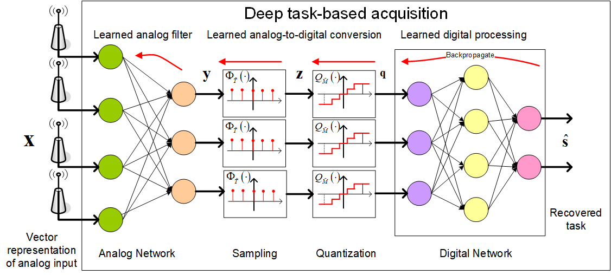

# Deep Task-Based Analog-to-Digital Conversion

In this work we design task-oriented ADCs which learn from data how to map an analog signal into a digital
representation such that the system task can be efficiently carried out. We propose a model for sampling and
quantization that facilitates the learning of non-uniform mappings from data. Based on this learnable ADC mapping, we
present a mechanism for optimizing a hybrid acquisition system comprised of analog combining, tunable ADCs with fixed
rates, and digital processing, by jointly learning its components end-to-end. Then, we show how one can exploit the
representation of hybrid acquisition systems as deep network to optimize the sampling rate and quantization rate given
the task by utilizing Bayesian meta-learning techniques.

<br>


## Prerequisites:

```
pip install -r requirements.txt
```

## Usage Example

```
python adc_learning.py --settings large --batch_size 100 --lr 1e-3
```
